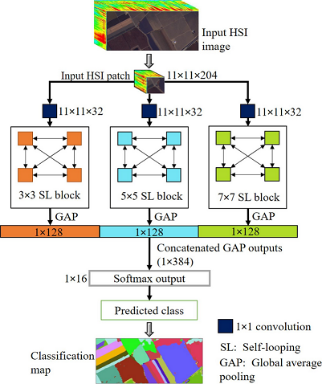

# HyperLoopNet: Hyperspectral image classification using multiscale self-looping convolutional networks

Hyperspectral image (HSI) classification using convolutional neural networks (CNNs) has always been a hot topic in the field of remote sensing. This is owing to the high level feature extraction offered by CNNs that enables efficient encoding of the features at several stages. However, the drawbacks with CNNs is that for exceptional performance, they need a deeper and wider architecture along with humongous amount of training data, which is often impractical and infeasible. Furthermore, the reliance on just forward connections leads to inefficient information flow that further limits the classification. Hence, to mitigate these issues, we propose a self-looping convolution network for HSI classification performance. In our method, each layer in a self-looping block contains both forward and backward connections, which means that each layer is the input and the output of every other layer, thus forming a loop. These loopy connections within the network allow for maximum information flow, thereby giving us a high level feature extraction. The self-looping connections enable us to efficiently control the network parameters, further allowing us to go for a wider architecture with a multiscale setting, thus giving us abstract representation at different spatial levels. We test our method on four benchmark hyperspectral datasets: Two Houston hyperspectral datasets (DFC 2013 and DFC 2018), Salinas Valley dataset and combined Pavia University and Centre dataset where our method achieves state of the art performance. 



>URL to the paper: https://www.sciencedirect.com/science/article/pii/S0924271621003191

Requirement:

```
Tensorflow 2
```
Steps:

```
1. Download the dataset from the provided URL in data folder
```
```
2. Run data_prepare.py
```
```
3. Run hyperloopnet.py
```

If using the concept or code, kindly cite the paper as: 
>S. Pande, B. Banerjee. HyperLoopNet: Hyperspectral image classification using multiscale self-looping convolutional networks. In The ISPRS Journal of Photogrammetry and Remote Sensing, January, 2022.

You can also use the bibtex as:
```
@article{pande2022hyperloopnet,
  title={Hyper{L}oop{N}et: Hyperspectral image classification using multiscale self-looping convolutional networks},
  author={Pande, Shivam and Banerjee, Biplab},
  journal={ISPRS Journal of Photogrammetry and Remote Sensing},
  volume={183},
  pages={422--438},
  year={2022},
  publisher={Elsevier}
}
```
